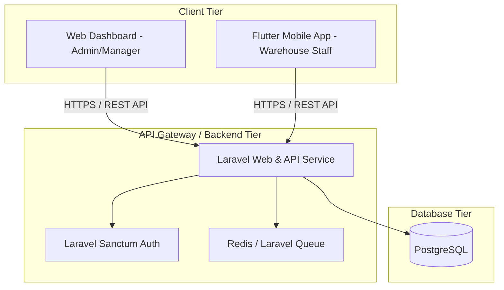
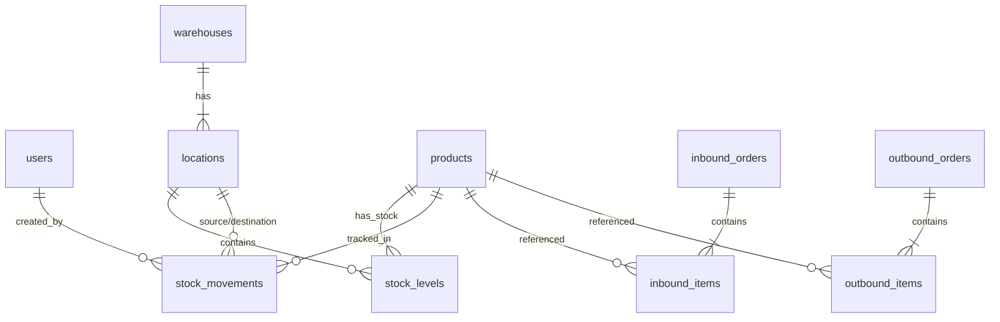
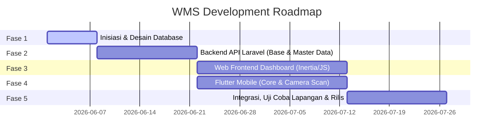

# MASTER PLAN & SPESIFIKASI SISTEM
## Warehouse Management System (WMS) - Web & Mobile

Dokumen ini berisi spesifikasi teknis dan rencana implementasi pembangunan sistem manajemen pergudangan (Warehouse Management System) berbasis Web (Laravel + Frontend JS) dan Mobile (Flutter) dengan fitur pemindaian barcode/QR code menggunakan kamera smartphone secara optimal.

---

## 1. Arsitektur Sistem

Sistem ini dirancang menggunakan arsitektur **Client-Server** dengan komunikasi data melalui **RESTful API** berbasis JSON.



### Detil Teknologi (Tech Stack)
*   **Database**: **PostgreSQL 15+**
    *   Mendukung data relasional yang kuat untuk konsistensi stok.
    *   Kemampuan indexing B-Tree & Hash untuk pencarian SKU/Barcode cepat.
    *   Mendukung tipe data JSONB untuk karakteristik barang yang dinamis (e.g., serial number, batch info).
*   **Backend & API**: **Laravel 10/11 (PHP 8.2+)**
    *   **Laravel Sanctum**: Untuk autentikasi token stateless bagi Flutter dan Web Frontend.
    *   **Laravel Jobs/Queues**: Untuk memproses mutasi stok besar, ekspor laporan, dan sinkronisasi data tanpa memblokir request utama.
*   **Web Frontend**: **React.js atau Vue.js (via Inertia.js) / Vanilla JS + Tailwind CSS**
    *   Digunakan oleh Admin & Manager untuk memantau stok, manajemen master data, laporan keuangan/logistik, dan otorisasi.
    *   *Rekomendasi*: **Inertia.js + React/Vue** agar performa Single Page Application (SPA) tetap maksimal namun terintegrasi erat dengan Laravel routing & controllers.
*   **Mobile App**: **Flutter 3.x (Dart)**
    *   Digunakan oleh staf lapangan/operator gudang.
    *   Fokus pada fitur: **Penerimaan Barang (Receiving)**, **Penempatan (Putaway)**, **Pengambilan (Picking)**, dan **Stock Opname**.
    *   Memaksimalkan kamera HP untuk scanning berkecepatan tinggi.

---

## 2. Modul Utama & Fitur Sistem

Sistem WMS dibagi menjadi beberapa modul utama yang mencakup aktivitas pergudangan end-to-end:

### A. Modul Master Data (Web Dashboard)
1.  **Manajemen Pengguna (User & Role Management)**:
    *   Role: Admin, Gudang Manager, Supervisor, Operator/Picker.
    *   Izin akses (Permissions) menggunakan library `spatie/laravel-permission`.
2.  **Manajemen Gudang & Lokasi (Warehouse & Location Management)**:
    *   Mendukung multi-gudang (Multi-Warehouse).
    *   Struktur lokasi hierarkis: Gudang -> Area -> Rak -> Baris -> Kolom/Bin.
3.  **Manajemen Produk (Product/SKU Catalog)**:
    *   Master barang (SKU, Nama, Kategori, Satuan/UOM, Barcode/EAN).
    *   Batas minimum stok (Safety Stock Alert).

### B. Modul Inbound Logistik (Penerimaan)
1.  **Purchase Order (PO) Tracking**: Integrasi atau input dokumen pemesanan.
2.  **Receiving (Mobile & Web)**:
    *   Penerimaan barang fisik di area unloading.
    *   Operator menggunakan **Flutter Mobile** untuk scan barcode barang, verifikasi kuantitas, dan mendeteksi barang rusak.
3.  **Putaway (Mobile)**:
    *   Sistem merekomendasikan lokasi rak penempatan berdasarkan kategori atau kapasitas rak.
    *   Operator men-scan barcode rak tujuan dan barcode barang untuk konfirmasi penempatan.

### C. Modul Manajemen Stok / Inventory (Web & Mobile)
1.  **Stock Mutation & Transfer**: Mutasi barang antar lokasi rak atau antar gudang.
2.  **Stock Opname (Mobile-driven)**:
    *   Proses stocktake berkala (harian/mingguan/bulanan).
    *   Operator menyisir rak, men-scan barcode lokasi, lalu men-scan setiap barang untuk menghitung jumlah fisik (system vs aktual).
3.  **Stock Alert**: Notifikasi otomatis via email/dashboard jika stok barang berada di bawah level minimum.

### D. Modul Outbound Logistik (Pengeluaran)
1.  **Sales Order / Delivery Order Integration**: Daftar barang yang harus dikirim.
2.  **Picking Route Optimization (Mobile)**:
    *   Sistem menghasilkan rute pengambilan terpendek berdasarkan layout rak (e.g., metode S-Shape atau Z-Shape) untuk mempercepat kerja operator.
    *   Operator memindai barcode lokasi rak dan memindai barang yang diambil untuk validasi akurasi picking.
3.  **Packing & Validation (Web/Mobile)**: Verifikasi akhir barang sebelum dimasukkan ke dalam boks pengiriman.
4.  **Shipping & Courier Integration**: Cetak label pengiriman dan update status kirim.

---

## 3. Strategi Optimalisasi Kamera Mobile (Flutter Scanning)

Untuk memastikan pemindaian barcode menggunakan kamera HP setara dengan performa *hardware scanner* khusus, kita akan menerapkan strategi berikut pada aplikasi Flutter:

### A. Teknologi Pemindaian (Scan Engine)
*   Menggunakan **Google ML Kit Barcode Scanning** (`google_mlkit_barcode_scanning`) di Flutter.
*   **Kelebihan**:
    *   Proses deteksi berjalan di perangkat secara lokal (on-device AI).
    *   Sangat cepat (sub-100 milidetik per scan).
    *   Dapat membaca barcode yang rusak, kotor, buram, beresolusi rendah, atau dalam kondisi cahaya redup (low light).
    *   Mendukung format barcode terlengkap (EAN-13, EAN-8, UPC-A, Code 39, Code 128, QR Code, Data Matrix, PDF417).

### B. Optimalisasi UX/UI Kamera Flutter
1.  **Continuous Scanning (Scan Berkelanjutan)**:
    *   Kamera tidak menutup setelah satu kali scan. Operator dapat melakukan pemindaian beruntun secara cepat.
    *   Terdapat mekanisme pencegahan *double-scan* dengan jeda waktu (debounce 1-2 detik) untuk barcode yang sama.
2.  **Target Overlay Box (Reticle)**:
    *   Membatasi area aktif kamera hanya di kotak tengah layar untuk mengurangi beban CPU (memproses area gambar yang lebih kecil).
3.  **Haptic & Audio Feedback**:
    *   Getaran halus (haptic vibration) dan suara "bip" instan ketika scan sukses, memberikan konfirmasi langsung ke operator tanpa perlu melihat layar HP.
4.  **Auto-Torch Control**:
    *   Tombol toggle senter (flashlight) yang mudah dijangkau di layar scan untuk membantu pemindaian di sudut rak yang gelap.
5.  **Auto-Focus & Zoom Lock**:
    *   Mengatur fokus kamera pada jarak dekat-menengah secara konstan agar tidak terus menerus mencari fokus.

### C. Offline Buffer & Sinkronisasi
*   Gudang sering kali memiliki area *blank spot* (tanpa sinyal Wi-Fi/seluler).
*   Aplikasi Flutter akan menggunakan database lokal **Isar Database** atau **SQLite** untuk menyimpan log pemindaian secara offline.
*   Saat koneksi internet terdeteksi kembali, aplikasi akan melakukan sinkronisasi otomatis (*background sync*) ke backend Laravel.

---

## 4. Perancangan Skema Database (PostgreSQL)

Berikut adalah rancangan tabel utama (ERD Logis) untuk mendukung alur kerja WMS:



### Struktur Tabel Utama (Draf Migrasi Laravel)

1.  **`warehouses`** (Gudang)
    *   `id` (UUID, PK)
    *   `code` (VARCHAR, Unique) - e.g., GDG-01
    *   `name` (VARCHAR)
    *   `address` (TEXT)

2.  **`locations`** (Lokasi Rak/Bin dalam Gudang)
    *   `id` (UUID, PK)
    *   `warehouse_id` (FK -> warehouses)
    *   `zone` (VARCHAR) - e.g., Area A, Area B
    *   `shelf` (VARCHAR) - e.g., Rak 12
    *   `tier` (VARCHAR) - e.g., Tingkat 3
    *   `bin` (VARCHAR) - e.g., Kotak A
    *   `barcode` (VARCHAR, Unique) - Kode barcode rak untuk di-scan (e.g., LOC-01-A-12-03-A)

3.  **`products`** (Katalog Barang)
    *   `id` (UUID, PK)
    *   `sku` (VARCHAR, Unique) - Stock Keeping Unit (e.g., PROD-TSHIRT-XL)
    *   `barcode` (VARCHAR, Unique) - Barcode produk (UPC/EAN/QR)
    *   `name` (VARCHAR)
    *   `description` (TEXT)
    *   `uom` (VARCHAR) - Unit of Measure (pcs, box, pack, kg)
    *   `safety_stock` (INTEGER) - Batas minimum peringatan stok
    *   `attributes` (JSONB) - Menyimpan informasi dinamis seperti warna, ukuran, tanggal kedaluwarsa.

4.  **`stock_levels`** (Posisi Stok Aktual saat ini)
    *   `id` (BIGINT, PK)
    *   `product_id` (FK -> products)
    *   `location_id` (FK -> locations)
    *   `quantity` (INTEGER)
    *   *Composite Unique Index*: (`product_id`, `location_id`) untuk mencegah duplikasi baris lokasi produk.

5.  **`stock_movements`** (Audit Trail / Riwayat Perubahan Stok)
    *   `id` (BIGINT, PK)
    *   `product_id` (FK -> products)
    *   `source_location_id` (FK -> locations, Nullable untuk Inbound)
    *   `destination_location_id` (FK -> locations, Nullable untuk Outbound)
    *   `quantity` (INTEGER)
    *   `type` (VARCHAR) - e.g., 'INBOUND', 'OUTBOUND', 'MUTATION', 'ADJUSTMENT'
    *   `reference_code` (VARCHAR) - Nomor dokumen referensi (PO / SO / Opname)
    *   `created_by` (FK -> users)
    *   `created_at` (TIMESTAMP)

---

## 5. Alur Integrasi API (API Contract Contoh)

Aplikasi Flutter akan berkomunikasi dengan backend Laravel menggunakan token autentikasi **Bearer JWT/Sanctum**.

### A. Autentikasi
*   **`POST /api/v1/auth/login`**
    *   Request: `{ "username": "picker1", "password": "securepassword" }`
    *   Response: `{ "token": "abcde12345...", "user": { "name": "Budi", "role": "operator" } }`

### B. Validasi Putaway (Menempatkan Barang ke Rak)
*   **`GET /api/v1/mobile/putaway/validate-location?barcode=LOC-01-A-12-03-A`**
    *   Tujuan: Mengecek apakah kode lokasi rak yang di-scan valid.
    *   Response: `{ "valid": true, "location": { "id": "uuid", "name": "Rak A-12-Tingkat 3" } }`
*   **`POST /api/v1/mobile/putaway/submit`**
    *   Tujuan: Mengirim data barang yang telah diletakkan di rak tersebut.
    *   Request:
        ```json
        {
          "location_id": "uuid-rak-a12",
          "scanned_items": [
            { "barcode": "8991234567890", "quantity": 10 },
            { "barcode": "8999876543210", "quantity": 5 }
          ]
        }
        ```
    *   Response: `{ "success": true, "message": "Stok berhasil ditempatkan & diperbarui." }`

---

## 6. Rencana Implementasi & Roadmap (Milestones)

Proyek ini akan dibagi menjadi 5 fase utama untuk memastikan pengujian dapat berjalan secara inkremental:



### Fase 1: Perencanaan & Setup Database (Minggu 1)
*   Setup repositori Git (Backend & Mobile).
*   Desain skema PostgreSQL secara detail dan penulisan migrasi Laravel.
*   Konfigurasi environment dan deployment server staging.

### Fase 2: Backend API Laravel (Minggu 2-3)
*   Pembuatan API autentikasi (Laravel Sanctum).
*   Implementasi CRUD Master Data (Product, Warehouse, Location).
*   Pembuatan modul mutasi stok dan logic transaksi (Inbound & Outbound).

### Fase 3: Web Dashboard (Minggu 4-6)
*   Slicing UI dashboard menggunakan Tailwind CSS.
*   Integrasi data master dan manajemen user/roles.
*   Pembuatan visualisasi stok gudang per lokasi (grid view rak).
*   Modul pelaporan mutasi stok dan ekspor dokumen.

### Fase 4: Flutter Mobile App (Minggu 4-6)
*   Slicing layout Flutter (sederhana, bersih, ramah sarung tangan industri).
*   Integrasi SDK Kamera Google ML Kit.
*   Optimasi performa scanner (vibration, sound, frame reduction).
*   Implementasi SQLite/Isar local cache untuk scanning offline.
*   Integrasi API Laravel untuk putaway, picking, dan stock opname.

### Fase 5: Integrasi & Uji Coba Gudang (Minggu 7-8)
*   End-to-end testing (Simulasi alur barang masuk hingga barang keluar menggunakan HP).
*   Tuning kecepatan respons scanning kamera.
*   Stress testing sinkronisasi data offline ke online.
*   Deployment ke server produksi dan perilisan aplikasi Flutter (.apk / Play Store internal).

---

## 7. Langkah Selanjutnya (Next Steps)
1.  **Persetujuan Master Plan**: Konfirmasi apakah struktur modul dan teknologi stack ini sudah sesuai dengan keinginan Anda.
2.  **Pembuatan Struktur Project**: Setelah disetujui, kita akan mulai menginisialisasi project Laravel di folder backend dan project Flutter di folder mobile.
