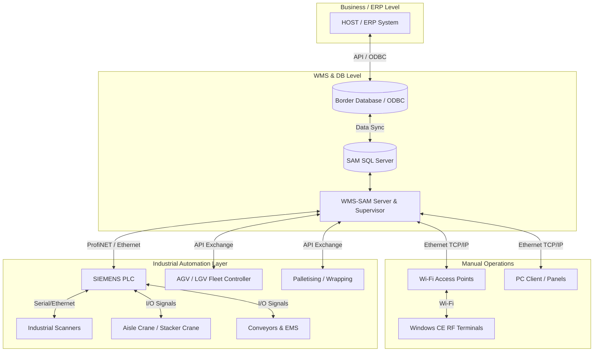

# ANALISIS MENDALAM: WMS-SAM (UTECO CONTEC)
## Arsitektur Enterprise, Otomasi Industri & Smart Warehouse Logistik

Laporan ini merupakan analisis teknis tingkat lanjut terhadap spesifikasi fungsional dan arsitektur sistem dari **WMS-SAM (Warehouse Management System - Software Automation Module)**. Evaluasi ini dilakukan dengan pendekatan sistem otomasi industri (*Industrial Automation System*) dan orkestrasi pergudangan pintar (*Smart Warehouse Orchestration*).

---

## 1. Inventory Management
Domain ini berfokus pada pengendalian stok dan akurasi pergerakan barang.
*   **Stock Control & Visibility**: Visibilitas stok bersifat *real-time* dengan akurasi tinggi ("Stock values always correct"). Sistem ini dapat memvisualisasikan ketersediaan stok melalui pemetaan grafis langsung ke antarmuka pengguna.
*   **Inventory Tracking & Movement**: Sistem mencatat setiap pergerakan (*movements*, *refilling*) secara historis, menjamin pelacakan yang auditabel.
*   **FIFO Management**: Metode perputaran stok dikelola secara ketat berbasis tanggal (tanggal produksi barang masuk maupun tanggal keluar).
*   **ABC Classification**: Manajemen perputaran produk diatur melalui klasifikasi ABC (rotasi tinggi, menengah, rendah), yang digunakan sebagai landasan pengambilan keputusan untuk penempatan dan pengambilan barang.

## 2. Warehouse Location Management
Pengelolaan dimensi fisik dan tata ruang gudang secara dinamis.
*   **Warehouse Mapping & Multi-Location**: Pemetaan total seluruh sudut gudang (per lokasi, per produk, per pallet). Sistem menangani berbagai bentuk struktur fisik (*multi-location*): rak manual, rak *drive-in*, *ground blocks* (tumpukan lantai), dan *macro locations*.
*   **Location Allocation & Space Optimization**: Pengelolaan ruang (*space optimization*) diatur secara otomatis oleh algoritma sistem untuk mencegah adanya ruang kosong yang tidak terutilisasi (*honeycombing*).
*   **Mono-Product & Multi-Product Channels**: Mendukung *mono-product* (satu jenis barang per palet) maupun *multi-product* (beberapa jenis barang dalam satu palet) dengan mempertimbangkan dimensi ketinggian palet (*size classes*).

## 3. Picking & Shipping Management
Optimalisasi pergerakan logistik keluar gudang (*Outbound*).
*   **Picking Logic & Sequence Optimization**: Sistem membuat urutan pengambilan (*picking sequence*) berdasarkan kriteria logis prioritas seperti: tujuan pengiriman, waktu kedatangan truk muat, dan jenis barang. Urutan ini meminimalkan waktu *loading/unloading* dan jarak tempuh operator.
*   **Automatic Picking**: Mendukung pengambilan berkonsep *Man-to-Man* (operator saling serah) maupun *Man-to-Goods* (operator menuju lokasi barang, dipandu rute optimal).
*   **Packing List Generation**: Sistem menghasilkan pencetakan *Packing-list* secara otomatis setelah tahapan konsolidasi *picking* selesai, sebagai persiapan akhir proses bongkar-muat (*loading*).

## 4. Warehouse Automation
Komunikasi sistem secara vertikal dengan mesin-mesin industri (*Shopfloor Layer*).
*   **Automatic Warehouse Missions**: Men-generate "Misi" (perintah gerak mekanis) secara otomatis berbasis aturan bisnis, lalu disalurkan ke sistem otomatis.
*   **PLC & Conveyor Integration**: Terkoneksi langsung secara *native* ke *SIEMENS PLC* untuk menggerakkan dan memantau status *Conveyor*, EMS (*Electrified Monorail Systems*), dan *Aisle Crane* (*Stacker Crane*).
*   **AGV/LGV Integration**: Memiliki kapabilitas komunikasi pertukaran data dua-arah dengan armada *AGV* (*Automated Guided Vehicles*) dan *LGV* (*Laser Guided Vehicles*).
*   **Terminal RF & Scanner**: Eksekusi operator manusia dipandu via Terminal Radio Frequency (*RF Terminals*) dan mesin pemindai *barcode* untuk kendali validasi instan.
*   **End-of-Line Integration**: Terkoneksi dengan sistem pihak ketiga seperti mesin *Palletising*, *Wrapping*, dan *Strapping*.

## 5. Warehouse Intelligence Features
Fitur kognitif atau logika prediktif dari WMS.
*   **Dynamic Allocation Logic (Smart Slotting)**: Algoritma pencarian lokasi kosong berdasarkan logika multi-variabel: kelas dimensi, berat beban, perputaran ABC, tanggal kedaluwarsa, dan jenis produk. Hal ini memastikan rak fisik tidak kelebihan beban dan mematuhi aturan penyimpanan.
*   **Off-Hours Optimization (Night Compaction)**: Fitur "kecerdasan" unik di mana pada jam tidak sibuk (malam/akhir *shift*), sistem menginstruksikan robot untuk merapikan gudang (*compacting*), menggeser pallet sisa untuk memaksimalkan kepadatan penyimpanan, melakukan penataan ulang kurva ABC, dan memutar kanal (*channel turning*) untuk mempertahankan aliran FIFO yang ketat.

## 6. Monitoring & Traceability
Sistem audit, jejak, dan analitik.
*   **Real-time Stock & Historical Tracking**: Visualisasi stok instan via denah gudang interaktif. Semua histori pemindahan (manual maupun oleh robot) dicatat dengan jejak audit yang tak dapat diubah.
*   **Statistical Analysis & Reporting**: Fungsionalitas analitik untuk memantau efektivitas operasi pergudangan (*effectiveness of systems*). Memberikan statistik utilitas yang berfungsi sebagai laporan kesehatan (*health report*) gudang bagi manajer.

---

## 7. Integration Architecture
Infrastruktur dan topologi komunikasi sistem WMS-SAM.

*   **WMS & ERP (HOST)**: Berkomunikasi via **Border Database (ODBC)**. ERP mengirim data pesanan dan barang; WMS mengembalikan status konfirmasi inventori. Pendekatan Border DB mencegah terjadinya interupsi jika satu sistem mengalami kelebihan beban.
*   **WMS & PLC / Mesin Otomatis**: WMS mengirimkan "misi" (vektor tujuan) via **ProfiNET / Ethernet** ke **Siemens PLC**. PLC menerjemahkan misi ini menjadi sinyal aktuator fisik (kecepatan motor, rem) pada *Aisle Crane* dan *Conveyors*.
*   **WMS & AGV/LGV**: Sinkronisasi data (*data exchange*) untuk mengoordinasikan titik muat/bongkar (*pick & drop points*) armada AGV agar tidak terjadi tabrakan logika dengan alat lain.
*   **WMS & RF Terminals**: Server berkomunikasi dengan terminal genggam berbasis Windows CE milik operator via Wi-Fi Access Points.

## 8. Customization & Scalability
*   **Configurability & Parametric System**: Fleksibilitas sangat tinggi. Sebagian besar konfigurasi berbasis *parameter* (ukuran palet, aturan perputaran, berat) sehingga gudang bisa direstrukturisasi tanpa *hard-coding*.
*   **Modular Expansion (Add-on Modules)**: Modul-modul tambahan (seperti penambahan armada AGV baru atau integrasi timbangan otomatis) dapat ditambahkan ke sistem setelah instalasi dasar tanpa waktu henti (*zero loss of initial investment*). Scalability sistem ini dirancang setingkat dengan kelas **Enterprise Warehouse**.

## 9. Operational Benefits
*   **Produktivitas Operator & Pengurangan Human Error**: Optimalisasi rute *picking* meminimalkan jarak jalan kaki; instruksi terminal *scanner* (*barcode*) memastikan nol toleransi pada *mis-picking* atau penempatan barang salah rak (*misplacement*).
*   **Efisiensi Handling & Optimasi Ruang**: Menekan waktu bongkar muat secara dramatis karena sistem otomatis menunjukkan lokasi penyimpanan terdekat yang kosong. Ruang termanfaatkan hingga 100% tanpa celah berkat logika klasifikasi *size class*.
*   **Digitalisasi & Paperless**: Penghapusan daftar *picking* fisik (*paperless picking lists*) serta penciptaan *Decision Support System* (DSS) instan berbasis data grafis *real-time*.

## 10. Technical Architecture Analysis
*   **Network Topology**: Bersifat *hybrid*. Memanfaatkan *Local Area Network* (Ethernet) kecepatan tinggi untuk *Client-Server*, Wi-Fi Industri (*Access Points*) untuk mobilitas terminal RF, dan jaringan industrial presisi tinggi (**ProfiNET**) untuk kontrol robotik PLC yang membutuhkan latensi di bawah milidetik.
*   **Industrial Automation Layer**: Sistem memisahkan antara tingkat "Logika Bisnis WMS" dengan "Tingkat Kontrol Fisik PLC". WMS bertindak layaknya *Conductor* (konduktor orkestra), sedangkan PLC bertindak sebagai *Musician* yang mengeksekusi instruksi pergerakan mekanis konveyor secara aktual. Terdapat jembatan VPN untuk *Remote Assistance* dari pihak Uteco Contec.

---

## 11. Analisis Kelebihan & Kekurangan Sistem

### Kelebihan Utama (Strengths)
1.  **Otomatisasi Orkestrasi (*Native WCS*)**: Ini bukan WMS biasa, melainkan WMS yang menyatu dengan *Warehouse Control System (WCS)*. Sistem mampu memerintah mesin *Stacker Crane* dan konveyor Siemens secara natif.
2.  **Otomasi Perawatan Malam Hari (*Night-Time Compaction*)**: Fitur restrukturisasi mandiri rak palet di malam hari untuk mempersiapkan operasi yang mulus keesokan harinya adalah indikator kecanggihan platform otomatis tingkat tinggi.
3.  **Border Database Isolator**: Menggunakan basis data perantara untuk ERP yang menjamin resiliensi. Kegagalan ERP tidak akan membuat operasional gudang lumpuh total.

### Kekurangan & Area Modernisasi (Weaknesses)
1.  **Terminal Radio Frekuensi Usang**: Penggunaan *Windows CE* sangat rawan dari sisi keamanan dan ketersediaan perangkat keras di masa depan. Perlu direvitalisasi menggunakan *Android Enterprise* (seperti aplikasi Flutter).
2.  **Ketiadaan Analitik Berbasis AI Modern**: Belum terdapat fitur analitik prediktif berbasis *Machine Learning*, seperti prediksi tren permintaan (untuk *slotting* musim liburan) atau deteksi anomali untuk pemeliharaan konveyor (Predictive Maintenance).
3.  **On-Premises Centric**: Tampaknya sistem sangat berat bertumpu pada infrastruktur *server* fisik lokal, menjadikannya kaku jika dibandingkan dengan arsitektur *Cloud Native* (SaaS).

---

## 12. Kesimpulan Tingkat Kematangan Sistem (Maturity Level)

Berdasarkan keseluruhan analisis mendalam di atas, WMS-SAM masuk ke dalam kategori:

> [!CAUTION]
> **Tingkat Kematangan: WAREHOUSE ORCHESTRATION SYSTEM (WES/WCS)**
> 
> WMS-SAM bukan lagi sekadar *Advanced WMS*. Kemampuannya dalam mengelola alur misi AGV, mengirim paket *routing* konveyor via ProfiNET, memandu Aisle Crane secara otonom, dan melakukan *Self-Organization* ruang gudang di malam hari (tanpa operator) menempatkannya secara kokoh sebagai **Warehouse Orchestration System** yang mengombinasikan kekuatan Logika Bisnis WMS dan Pengendalian Robotik (WCS).
>
> Sistem ini siap mendukung pabrik dengan standar *Industry 4.0*, meski secara antarmuka pengguna seluler (*mobile UI*), sistem ini membutuhkan pembaruan kritis agar relevan dengan teknologi *touch-screen* saat ini.
