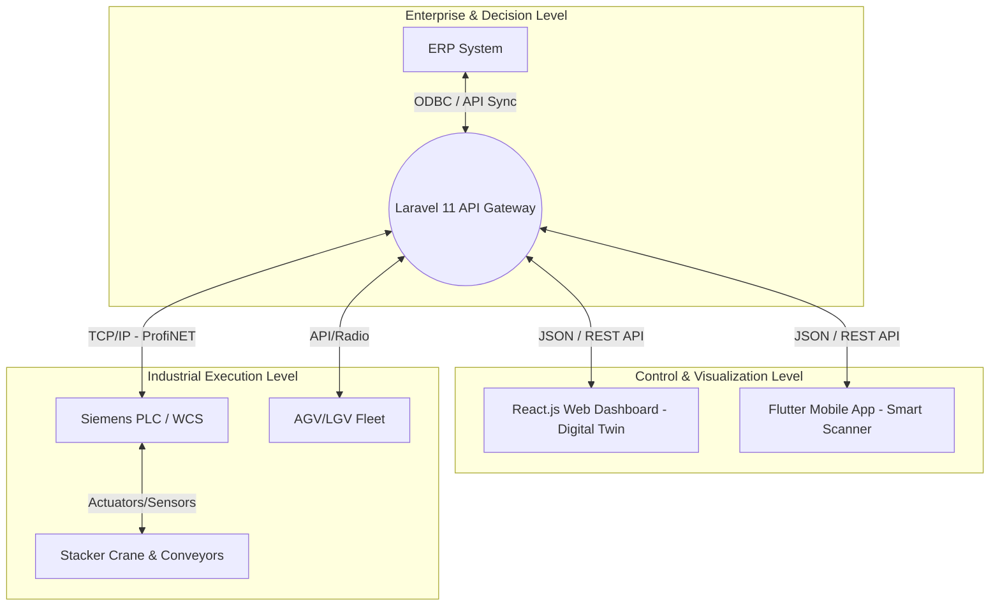

# AERO WMS: UNIFIED BLUEPRINT & ROADMAP
*Dokumen Konsolidasi: WMS Master Plan + WMS Analysis + WMS-SAM Deep Analysis*

---

## 1. Executive Summary
Aero WMS dirancang untuk tidak sekadar menjadi sistem pencatatan inventaris (Basic WMS), melainkan sebuah **Warehouse Orchestration System (WES/WCS)** tingkat Enterprise. Sistem ini mengadopsi standar logika pabrik pintar (*Smart Factory / Industry 4.0*) yang terinspirasi dari arsitektur *Uteco Contec WMS-SAM*, di mana perangkat lunak secara proaktif mengendalikan mesin (PLC, AGV, Stacker Crane) sekaligus memandu manusia melalui antarmuka seluler modern.

## 2. Arsitektur Integrasi Terpadu (Unified Stack)

Sistem menggunakan topologi hibrida (*hybrid*) yang menghubungkan lapisan manajemen hingga eksekusi lantai pabrik (*shopfloor*).

### Pemilihan Teknologi:
*   **Database**: PostgreSQL / SQLite (Menangani hierarki *Size Classes*, rotasi *FIFO/ABC*).
*   **Logika & WCS Bridge**: Laravel 11 (Bertindak sebagai *Brain* sekaligus *Border Database* untuk isolasi dari ERP).
*   **Monitor & HMI**: React.js + Vite (Visualisasi *Digital Twin*, *Auto-Gate Simulation*).
*   **Eksekutor Manusia**: Flutter 3.x (Aplikasi *scanner* genggam pengganti *Windows CE* kuno dengan integrasi *Google ML Kit*).

---

## 3. Fitur Utama (Smart Warehouse Core Domains)

1.  **Inventory & ABC Intelligence**:
    *   Sistem tidak hanya mencatat jumlah, tapi memantau "kesehatan" rotasi (Kelas A/B/C).
    *   Mendukung *Mono-product* (palet sejenis) dan *Multi-product* (palet campuran).
2.  **Location & Bin Slotting (Algoritma Penempatan)**:
    *   Sistem secara otomatis mengarahkan palet ke tingkat rak (*tier*) yang sesuai dengan beban dan dimensi palet, menjaga keselamatan struktur rak.
3.  **Inbound (Auto-Gate) & Outbound (Sequence Picking)**:
    *   Validasi dimensi instan (*Dock-to-Stock* otomatis).
    *   Sistem membuat rute logis untuk *picker* agar tidak terjadi tabrakan rute (kolisi) di lorong rak.
4.  **Off-Hours Optimization (Night Compaction)**:
    *   *(Advanced Feature)* Logika *backend* yang merestrukturisasi palet di malam hari untuk merapatkan celah (*honeycombing*) dan menyatukan barang FIFO.

---

## 4. Status Progress Saat Ini (Tercapai)

Sistem telah sukses melewati fase fondasi dan memasuki tahapan fungsional operasional dasar:

*   ✅ **Database & Migrations**: Skema terstruktur dengan relasi WCS (Warehouse, Location, Product, Stock, Transaction).
*   ✅ **Backend API (Laravel)**: *Endpoints* siap pakai dengan autentikasi (Sanctum) dan sistem *rollback* transaksi (ACID Compliance) untuk logika penerimaan (Putaway).
*   ✅ **Web Dashboard (React)**: 
    *   Desain Premium UI (*Glassmorphism* cerah).
    *   Integrasi data Master (SKU & ABC Class) yang langsung ditarik dari API Laravel.
    *   Panel *Real-time Stock* (FIFO) dengan indikator sinkronisasi mesin (ProfiNET Live).
    *   Simulasi layar *Inbound & Auto-Gate* bergaya HMI pabrik untuk eksekusi barang masuk secara sistem.

---

## 5. Rencana Fase Lanjutan (The Next Steps Roadmap)

Karena fondasi teori (Analisis) dan praktik (Web & API) sudah sinkron, langkah kita selanjutnya bergeser pada eksekusi lapangan dan otomatisasi tingkat lanjut.

### Fase Lanjutan A: Pemberdayaan Operator Gudang (Flutter Mobile)
*Fokus: Mengganti perangkat Windows CE usang dengan Smartphone Android modern.*
1.  **Inisiasi Flutter Project**: Setup struktur direktori UI (*Scanner/Camera*, *Putaway*, *Picking*).
2.  **Integrasi ML Kit**: Pembuatan mesin *scan barcode* secepat kilat tanpa jeda (mampu baca *barcode* buram/kotor).
3.  **Feedback Industri**: Menambahkan getaran (*haptic*) dan bunyi *Beep* nyaring saat *scan* agar operator tak perlu selalu menatap layar.
4.  **Offline Cache Mode**: Mengamankan *scan* jika WiFi gudang terputus (blank spot) via Isar/SQLite lokal.

### Fase Lanjutan B: Simulasi Robotik & Outbound (Web Dashboard)
*Fokus: Menutup siklus pergerakan barang (Barang Keluar / Misi Robot).*
1.  **Outbound & Picking Interface**: Simulasi layar untuk operator *forklift* atau sistem untuk mengekstrak barang keluar (*generate Packing List*).
2.  **AGV/Crane Missions Monitor**: Membuat layar pelacakan "Digital Twin" sederhana yang melacak pergerakan palet masuk dan keluar secara grafis.

### Fase Lanjutan C: Logic Pintar AI & Analytics (Backend)
*Fokus: Memasukkan "Otak" ke dalam sistem.*
1.  **Algoritma Night Compaction**: Membuat *Cron Job* (Laravel Task Scheduler) yang mensimulasikan perapian rak otomatis setiap jam 12 malam.
2.  **Smart Slotting AI**: Prediksi penempatan barang menjelang musim liburan (*Peak Season*).

---

> **Keputusan Strategis:** Rencana kolaborasi ini mengesahkan bahwa WMS kita sudah bukan aplikasi gudang biasa. Kita siap melangkah ke tahap implementasi mobile atau penambahan modul analitik prediktif.
